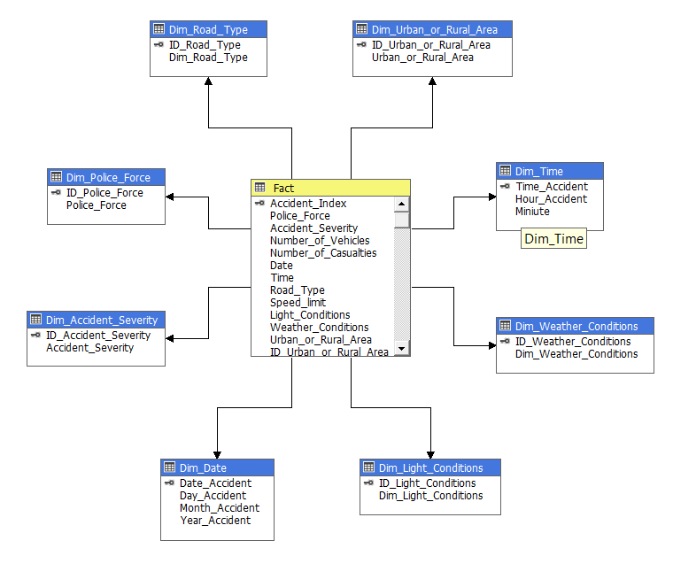

# Using SQL Server Analysis Services to create Cubes for querying and analyzing data within those Cubes.

- Data: Accident in UK is Data warehouse is created by SSIS project 
    + <a href="https://github.com/vanac17122001/Data_WareHouse_Accidents_SSIS">Link to SSIS project to create Data Warehouse</a>
    + <a href="https://github.com/vanac17122001/Accidents_In_UK_SSRS_PowerBI">Link to SSRS and Power BI project</a>
- Image for CUBE

- Reference: https://www.youtube.com/watch?v=bO1VhaOFFmI&ab_channel=SoanTr%E1%BA%A7n , Quá trình SSAS- Data Warehouse& OLAP - với dữ liệu về t.a.i n.a.n ở Anh, Soan Trần